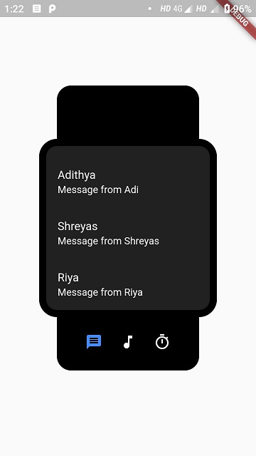
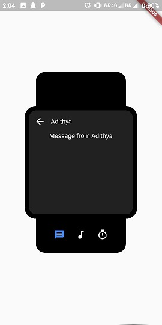
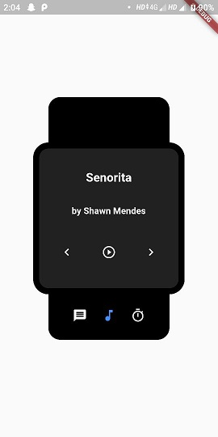
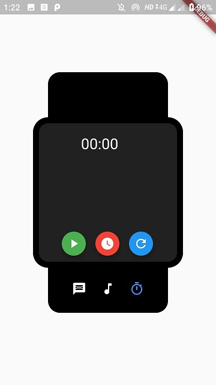
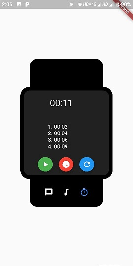

# smart_watch :watch:

This project is built using [*FLUTTER*](https://flutter.dev/)

## Installation

[To install flutter](https://flutter.dev/docs/get-started/install)  
[To install VS Code](https://code.visualstudio.com/docs/setup/setup-overview)  
[To install AndriodStudio](https://developer.android.com/studio/install) 

A few resources to get you started if this is your first Flutter project:

- [Lab: Write your first Flutter app](https://flutter.dev/docs/get-started/codelab)
- [Cookbook: Useful Flutter samples](https://flutter.dev/docs/cookbook)

For help getting started with Flutter, view
[online documentation](https://flutter.dev/docs), which offers tutorials,
samples, guidance on mobile development, and a full API reference.

# TASK 1
*In Messages, the user should be able to browse through the stored messages. (1) They should be able to swipe through the messages to browse their messages, and (2) tap (click) on them to read the content.*

    
    

# TASK 2
*In Music Player, the user should be able to control the music. (1) The user should be able to browse the Spotify playlist, and (2) control the player using the play/ pause, previous, and next buttons.*

  

# TASK 3
*In Timer, the user should be able to record lap timings. (1) The user should be able to record multiple lap timings, and (2) reset the timer to its default state.*

    
    

## Steps to Run
**In Android Studio**: *Run* -> *Run main.dart*  OR  press  *Shift+F10*  
**In VSCode**: *Debug* -> *Start debuging* OR  press *F5* 
